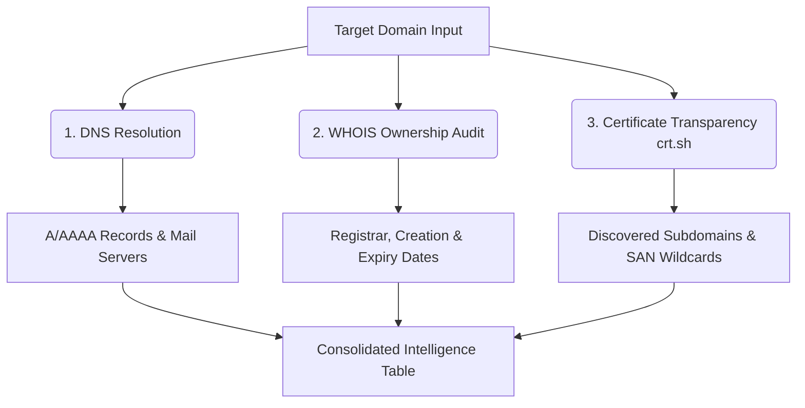

# 🔍 Domain Intel Scout Skill

> **Autonomous Passive Reconnaissance & Attack Surface Discovery Skill for Sovereign AI Agents**  
> *Structured first-pass domain intelligence using DNS enumeration, WHOIS ownership inspection, and Certificate Transparency logs via crt.sh.*

[](#overview)
[](#compatibility)
[](#safety--ethics)
[](#license)

---

## ✦ Overview

**Domain Intel Scout** is an autonomous skill module designed for agentic workflows (compatible with Nous Research Hermes Agent, Codex CLI, and Google AGY SDK). It equips agents with an automated, non-invasive reconnaissance workflow to map an organization's digital footprint without human micro-management.

Unlike noisy active vulnerability scanners, Domain Intel Scout operates entirely passively, extracting intelligence from public authoritative nameservers, registrar records, and cryptographic Certificate Transparency (CT) logs.

---

## ✦ Capabilities & Procedures



### 1. DNS Reconnaissance
Identifies primary IPv4/IPv6 endpoints, mail servers (MX), and cloud hosting providers:
```bash
dig +short A <domain>
dig +short AAAA <domain>
dig +short MX <domain>
dig +short TXT <domain>
```

### 2. Registrar & Ownership Audit
Filters privacy redaction noise to isolate critical dates and authoritative registrars:
```bash
whois <domain> | grep -Ei "Creation Date|Registrar|Registry Expiry"
```

### 3. Passive Subdomain Discovery via CT Logs
Queries the global public Certificate Transparency logs without sending a single packet to the target server:
```bash
curl -s "https://crt.sh/?q=%25.<domain>&output=json" | jq -r '.[].common_name' | sort -u
```

---

## ✦ Installation & Compatibility

### For Nous Hermes Agent
Drop into your Hermes skills directory:
```bash
hermes skill install NullAITech/osint-scout-skill
```

### For ZothOS / Local Agent Swarms
Symlink or copy into `~/.hermes/skills/` or `~/.agents/skills/`:
```bash
git clone https://github.com/NullAITech/osint-scout-skill.git ~/.hermes/skills/domain-intel-scout
```

### Required Dependencies
* `dnsutils` (`dig`)
* `whois`
* `curl`
* `jq`

---

## ✦ Safety, Ethics & Rules of Engagement

- **Authorized Auditing**: Intended strictly for security researchers, developers, and red teams auditing infrastructure with appropriate authorization.
- **Zero Port Scanning**: This skill performs **zero** TCP/UDP port scans and sends no intrusive payloads.
- **Zero Exfiltration**: All parsed metadata is presented directly in the operator's terminal context in clean markdown tables.

---

## ✦ License

Part of the **[NullAI Tech](https://github.com/NullAITech)** open security ecosystem. Distributed under the MIT License.
